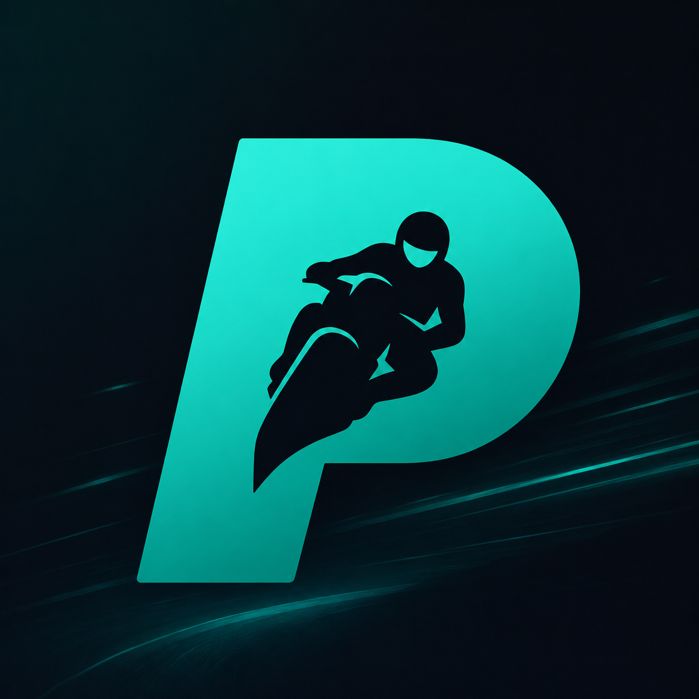

<p align="center">
  
</p>

<h1 align="center">Pillion</h1>

<p align="center">
  
  
  
  
  <a href="https://discord.gg/mxNV97QUnB"></a>
</p>

> **🚧 Alpha.** Android-only for now and under active development — it works on my MT-07 (2025) but is
> rough, and the protocol/UI may still change. **iOS support is planned.** Expect bugs, and please
> [report them](../../issues) (especially compatibility on other bikes).

**Cast your phone's screen to a Yamaha motorcycle TFT dash over Bluetooth** — so you can run
Waze, Google Maps, or anything else on the bike's built-in display instead of being limited to
Garmin StreetCross.

Pillion is an independent, reverse-engineered implementation of the **NaviLite** protocol (the same
protocol Garmin StreetCross uses to project navigation to the dash), built for interoperability. It
is **not** affiliated with, authorized by, or endorsed by Yamaha or Garmin.

> **Measured:** ~**14–15 fps** at 480×240 over Bluetooth on a Yamaha MT-07 (2025). Smooth enough to
> follow a moving map.

---

## ⚠️ Safety first

This puts arbitrary content on a **moving motorcycle's dashboard**. Read **[SAFETY.md](SAFETY.md)**
before using it. Short version: **do not watch video or anything distracting while riding.** Use a
glanceable navigation view, or use it parked. You are responsible for riding safely and for any
local laws about screens/displays while riding.

---

## What it does

- Mirrors your **Android** phone screen to the bike's TFT at ~480×240, ~5–15 fps (tunable).
- Works with **any** app on your phone (Waze, Google Maps, Organic Maps, music, etc.) — it casts the
  screen, so it isn't tied to a specific nav app.
- Connects directly over Bluetooth; **no internet required** while riding.

## Supported bikes

Any Yamaha that uses the **Garmin "Communication Control Unit" (CCU)** / works with the Garmin
StreetCross app. Confirmed working by the community so far:

| Model | Phone / OS | Streams? | fps | Reported by |
|-------|------------|:-------:|-----|-------------|
| **MT-07 (2025)** | — | ✅ | ~14–15 | maintainer |
| **R9 (2026)** | Galaxy S25 Ultra / Android 16 | ✅ | ~15, smooth | @rf7719. |
| **MT-09 (2025)** | Galaxy S23 / Android 16 | ✅ | ~11–12 | @mobiusixi6246 |
| **MT-09 SP (2026)** | Android | ✅ | — | @raccoon_builds |

Very likely also works on other models with the same CCU platform (e.g. XSR900 GP, Tracer 9 GT+,
Niken GT, TMAX, XMAX), since the protocol is shared — **more reports welcome** (open an issue or
post in the Discord with your model + result).

The auth is universal — there is **no per-bike key or pairing secret** to extract (see
[docs/PROTOCOL.md](docs/PROTOCOL.md)).

## Install (Android)

1. Download the latest `Pillion.apk` from [**Releases**](../../releases).
2. Sideload it (enable "install unknown apps" for your browser/file manager).
3. Pair your phone to the bike's Bluetooth as you normally would.
4. On the bike, **select the navigation screen** on the TFT.
5. Open **Pillion**, grant the screen-capture prompt, and tap **Start**. Then open Waze/Maps in
   **landscape**.

> Note: only run **one** projection app at a time — close Garmin StreetCross / Yamaha MyRide first,
> or they'll fight Pillion for the connection.

## Updates

Pillion checks **[GitHub Releases](../../releases)** once on launch and shows an in-app **"Update
available"** banner (with the changelog) when a newer build exists — tap **Get** to download the new
APK. Each release also lists what changed; see **[CHANGELOG.md](CHANGELOG.md)**.

## How it works

Pillion speaks **NaviLite** over Bluetooth Classic RFCOMM (SPP UUID `0x7220`): a small framed
protocol with a CRC-32/MPEG-2 checksum, a trivial de-obfuscate-and-echo handshake, and a JPEG image
channel. Your screen is captured, scaled to 480×240, JPEG-encoded, and streamed frame-by-frame.

The full wire spec is documented in **[docs/PROTOCOL.md](docs/PROTOCOL.md)**.

## Build from source

A Kotlin Multiplatform + Compose Multiplatform project; the Android app module is `composeApp`.
Requires the Android SDK + JDK 17 (or just Android Studio).

```bash
git clone https://github.com/alexandrevega/pillion.git
cd pillion
./gradlew :composeApp:assembleDebug   # -> composeApp/build/outputs/apk/debug/composeApp-debug.apk
./gradlew :composeApp:testDebugUnitTest   # protocol unit tests (CRC + auth vectors)
```

Or open the project in Android Studio and Run. The shared protocol/engine lives in
`composeApp/src/commonMain` (ready for an iOS target later); Android specifics are in
`composeApp/src/androidMain`.

## License

**[PolyForm Noncommercial 1.0.0](LICENSE.md)** — free to use, modify, and share for **non-commercial**
purposes. Commercial use requires a separate license. This is a hobby / interoperability project.

## Legal / disclaimer

- Independent interoperability project. **Not affiliated with Yamaha or Garmin.** "Yamaha", "Garmin",
  and "StreetCross" are trademarks of their respective owners, used here only descriptively.
- Contains **no** Garmin/Yamaha code or binaries — only an original, independent implementation of an
  observed protocol and original documentation of it.
- Provided **as-is, with no warranty.** Use at your own risk; you are responsible for safe and lawful
  use. See [LICENSE.md](LICENSE.md) and [SAFETY.md](SAFETY.md).

## Community

Questions, setup help, or a compatibility report? **[Join the Discord](https://discord.gg/mxNV97QUnB)** 💬
— there's a support forum, bike-specific roles, and release announcements.

## Contributing

See [CONTRIBUTING.md](CONTRIBUTING.md). Bug reports, bike-compatibility reports, and PRs welcome.
